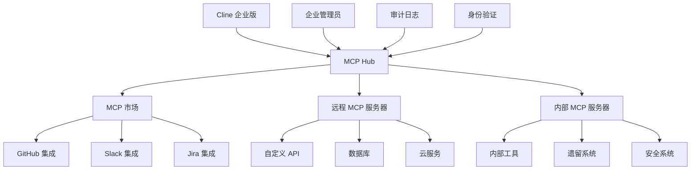

模型上下文协议 (MCP) 提供 AI 模型与外部数据源、工具和服务之间的标准化通信。企业 MCP 集成允许你在保持治理和合规的同时，将 Cline 安全地连接到你组织的系统。

## 企业 MCP 优势

<CardGroup cols={2}>
  <Card title="可扩展架构" icon="puzzle-piece">
    通过标准化的 MCP 服务器连接到无限的外部工具、数据库、API 和服务。
  </Card>
  
  <Card title="企业安全" icon="shield-alt">
    为所有 MCP 服务器通信提供安全身份验证、授权和审计跟踪。
  </Card>
  
  <Card title="集中管理" icon="network-wired">
    使用版本控制和配置管理在企业范围内管理和部署 MCP 服务器。
  </Card>
  
  <Card title="合规就绪" icon="clipboard-check">
    内置日志记录、监控和数据治理，满足合规性要求。
  </Card>
</CardGroup>

## MCP 架构概述



## 核心组件

<CardGroup cols={2}>
  <Card title="MCP 市场" icon="store" href="/enterprise-solutions/configuration/infrastructure-configuration/mcp/mcp-marketplace">
    为热门工具和服务提供预构建、企业就绪的 MCP 服务器，支持一键部署。
  </Card>
  
  <Card title="远程 MCP 服务器" icon="server" href="/enterprise-solutions/configuration/infrastructure-configuration/mcp/remote-mcp-servers">
    通过集中配置在整个基础设施中部署和管理自定义 MCP 服务器。
  </Card>
</CardGroup>

## 企业配置

### 基本 MCP Hub 设置

为你的企业部署配置中央 MCP hub：

```yaml
# mcp-hub-config.yaml
mcp:
  hub:
    enabled: true
    port: 8080
    authentication:
      method: "enterprise-sso"
      jwt_secret: "${MCP_JWT_SECRET}"
      
    # 服务器发现
    discovery:
      methods: ["marketplace", "remote", "local"]
      marketplace_url: "https://mcp.cline.bot/marketplace"
      
    # 安全设置
    security:
      enforce_tls: true
      allowed_origins: ["https://*.company.com"]
      rate_limiting:
        requests_per_minute: 1000
        burst_size: 100
        
    # 审计和合规
    audit:
      enabled: true
      log_level: "INFO"
      destinations: ["file", "syslog", "datadog"]
      retention_days: 90
```

### 多环境配置

跨环境部署 MCP 配置：

<Tabs>
<Tab title="开发环境">
```yaml
# mcp-dev-config.yaml
mcp:
  environment: "development"
  
  servers:
    - name: "github-dev"
      type: "marketplace"
      package: "@cline/mcp-github"
      version: "latest"
      config:
        github_token: "${GITHUB_DEV_TOKEN}"
        org: "company-dev"
        
    - name: "local-db"
      type: "remote" 
      url: "http://localhost:3001"
      auth:
        type: "api-key"
        key: "${DEV_DB_API_KEY}"
        
  policies:
    allow_experimental: true
    auto_update: true
    rate_limits:
      relaxed: true
```
</Tab>

<Tab title="生产环境">
```yaml
# mcp-prod-config.yaml
mcp:
  environment: "production"
  
  servers:
    - name: "github-prod"
      type: "marketplace"
      package: "@cline/mcp-github"
      version: "1.2.3"  # 固定版本
      config:
        github_token: "${GITHUB_PROD_TOKEN}"
        org: "company"
        
    - name: "crm-integration"
      type: "remote"
      url: "https://mcp-crm.internal.company.com"
      auth:
        type: "mtls"
        cert_path: "/certs/mcp-client.pem"
        key_path: "/certs/mcp-client-key.pem"
        
    - name: "security-scanner"
      type: "remote"
      url: "https://security-mcp.company.com"
      auth:
        type: "oauth2"
        client_id: "${SECURITY_CLIENT_ID}"
        client_secret: "${SECURITY_CLIENT_SECRET}"
        
  policies:
    allow_experimental: false
    auto_update: false
    strict_versioning: true
    
  monitoring:
    metrics: true
    health_checks: true
    alert_on_failure: true
```
</Tab>
</Tabs>

## 服务器管理

### 生命周期管理

使用 GitOps 管理 MCP 服务器部署：

```yaml
# mcp-server-manifest.yaml
apiVersion: mcp.cline.bot/v1
kind: MCPServer
metadata:
  name: custom-api-server
  namespace: cline-enterprise
spec:
  image: company/custom-mcp-server:v1.0.0
  replicas: 3
  
  config:
    api_endpoint: "https://api.internal.company.com"
    timeout: 30s
    retry_attempts: 3
    
  auth:
    type: service-account
    service_account: mcp-custom-api
    
  resources:
    requests:
      memory: "256Mi"
      cpu: "100m"
    limits:
      memory: "512Mi" 
      cpu: "500m"
      
  monitoring:
    enabled: true
    metrics_port: 9090
    health_endpoint: "/health"
    
  security:
    network_policy: strict
    pod_security_standard: restricted
```

### 配置管理

使用 Helm 图表进行企业 MCP 部署：

```yaml
# values-prod.yaml
mcp:
  hub:
    replicaCount: 3
    image:
      repository: cline/mcp-hub-enterprise
      tag: "1.5.2"
      
  servers:
    marketplace:
      enabled: true
      catalog_url: "https://enterprise-catalog.company.com"
      
    custom:
      - name: "salesforce"
        enabled: true
        image: "company/mcp-salesforce:1.0.0"
        config:
          instance_url: "https://company.my.salesforce.com"
          
      - name: "jira"
        enabled: true
        image: "company/mcp-jira:2.1.0"
        config:
          base_url: "https://company.atlassian.net"
          
  ingress:
    enabled: true
    className: nginx
    annotations:
      cert-manager.io/cluster-issuer: "letsencrypt-prod"
    hosts:
      - host: mcp.company.com
        paths:
          - path: /
            pathType: Prefix
    tls:
      - secretName: mcp-tls
        hosts:
          - mcp.company.com
```

## 安全与治理

### 身份验证与授权

为 MCP 服务器配置企业身份验证：

```yaml
# mcp-auth-config.yaml
authentication:
  providers:
    - name: "enterprise-sso"
      type: "oidc"
      issuer: "https://sso.company.com"
      client_id: "${SSO_CLIENT_ID}"
      client_secret: "${SSO_CLIENT_SECRET}"
      
    - name: "service-accounts"
      type: "jwt"
      signing_key: "${SERVICE_ACCOUNT_KEY}"
      
authorization:
  policies:
    - name: "developers"
      subjects: ["group:developers"]
      resources: ["mcp:servers:read", "mcp:servers:execute"]
      
    - name: "admins"
      subjects: ["group:mcp-admins"]
      resources: ["mcp:*"]
      
    - name: "security-team"
      subjects: ["group:security"]
      resources: ["mcp:audit:*", "mcp:servers:security-*"]
      
  rbac:
    enabled: true
    default_role: "viewer"
```

### 网络安全

为 MCP 通信实施网络策略：

```yaml
# mcp-network-policy.yaml
apiVersion: networking.k8s.io/v1
kind: NetworkPolicy
metadata:
  name: mcp-server-policy
  namespace: cline-enterprise
spec:
  podSelector:
    matchLabels:
      app: mcp-server
  policyTypes:
    - Ingress
    - Egress
    
  ingress:
    - from:
        - namespaceSelector:
            matchLabels:
              name: cline-enterprise
        - podSelector:
            matchLabels:
              app: cline-core
      ports:
        - protocol: TCP
          port: 8080
          
  egress:
    # 允许 DNS
    - to: []
      ports:
        - protocol: UDP
          port: 53
    # 允许 HTTPS 访问外部 API
    - to: []
      ports:
        - protocol: TCP
          port: 443
```

## 监控与可观测性

### 指标收集

配置全面的 MCP 监控：

```yaml
# mcp-monitoring.yaml
monitoring:
  metrics:
    enabled: true
    interval: 30s
    
    collectors:
      - name: "server-health"
        metrics:
          - mcp_server_status
          - mcp_server_response_time
          - mcp_server_error_rate
          
      - name: "hub-performance"
        metrics:
          - mcp_hub_requests_total
          - mcp_hub_request_duration
          - mcp_hub_active_connections
          
      - name: "resource-usage"
        metrics:
          - mcp_memory_usage
          - mcp_cpu_usage
          - mcp_network_io
          
  alerts:
    - name: "server-down"
      condition: "mcp_server_status == 0"
      severity: "critical"
      notification_channels: ["pagerduty", "slack"]
      
    - name: "high-error-rate"
      condition: "mcp_server_error_rate > 0.05"
      severity: "warning"
      notification_channels: ["slack"]
      
    - name: "performance-degradation"
      condition: "mcp_server_response_time > 5s"
      severity: "warning"
      notification_channels: ["email"]
```

### 审计日志

实施全面的审计跟踪：

```json
{
  "timestamp": "2024-01-15T10:30:00Z",
  "event_type": "mcp_server_call",
  "user_id": "john.doe@company.com",
  "session_id": "sess_abc123",
  "server_name": "github-prod",
  "method": "github.create_issue",
  "request": {
    "repository": "company/project",
    "title": "Bug fix required",
    "sensitive_data_detected": false
  },
  "response": {
    "status": "success",
    "issue_id": "12345",
    "duration_ms": 234
  },
  "compliance": {
    "data_classification": "internal",
    "retention_required": true,
    "pii_detected": false
  }
}
```

## 自定义 MCP 服务器开发

### 开发框架

使用企业 SDK 创建自定义 MCP 服务器：

```typescript
// custom-mcp-server.ts
import { MCPServer, Tool, Resource } from '@cline/mcp-enterprise-sdk';

class CustomAPIServer extends MCPServer {
  constructor() {
    super({
      name: 'custom-api-server',
      version: '1.0.0',
      description: 'Custom API integration server'
    });
    
    this.addTool(new DatabaseQueryTool());
    this.addResource(new UserDataResource());
  }
}

class DatabaseQueryTool implements Tool {
  name = 'query_database';
  description = 'Query company database';
  
  async execute(params: any) {
    // 实现数据库查询逻辑
    const result = await this.database.query(params.sql);
    
    // 审计日志查询
    await this.auditLog({
      action: 'database_query',
      query: params.sql,
      user: params.user_id,
      results_count: result.length
    });
    
    return result;
  }
  
  async validate(params: any): Promise<boolean> {
    // 实现查询验证
    return params.sql && !this.containsMaliciousSQL(params.sql);
  }
}
```

### 部署流水线

自动化 MCP 服务器部署：

```yaml
# .github/workflows/deploy-mcp-server.yml
name: Deploy MCP Server
on:
  push:
    branches: [main]
    paths: ['mcp-servers/**']
    
jobs:
  deploy:
    runs-on: ubuntu-latest
    steps:
      - uses: actions/checkout@v3
      
      - name: Build MCP Server
        run: |
          docker build -t company/mcp-server:${{ github.sha }} .
          docker push company/mcp-server:${{ github.sha }}
          
      - name: Deploy to Staging
        run: |
          helm upgrade mcp-server-staging ./helm-chart \
            --set image.tag=${{ github.sha }} \
            --namespace mcp-staging
            
      - name: Run Integration Tests
        run: |
          kubectl wait --for=condition=ready pod -l app=mcp-server -n mcp-staging
          npm run test:integration
          
      - name: Deploy to Production
        if: success()
        run: |
          helm upgrade mcp-server-prod ./helm-chart \
            --set image.tag=${{ github.sha }} \
            --namespace mcp-prod
```

## 最佳实践

### 安全性
1. **身份验证**：始终要求 MCP 服务器进行身份验证
2. **加密**：对所有 MCP 通信使用 TLS
3. **验证**：验证所有输入并清理输出
4. **最小权限**：授予最小所需权限
5. **审计**：记录所有 MCP 服务器交互

### 性能
1. **缓存**：在适当的地方实施响应缓存
2. **连接池**：重用与外部服务的连接
3. **异步操作**：对 I/O 使用非阻塞操作
4. **资源限制**：设置适当的 CPU 和内存限制
5. **负载均衡**：根据需求扩展 MCP 服务器

### 可靠性
1. **健康检查**：实施全面的健康端点
2. **断路器**：当外部服务宕机时快速失败
3. **重试逻辑**：对失败实施指数退避
4. **优雅降级**：提供回退行为
5. **监控**：设置主动警报和监控

## 生产检查清单

在将 MCP 服务器部署到生产环境之前：

- [ ] 安全审查已完成
- [ ] 身份验证和授权已配置
- [ ] 网络策略已实施
- [ ] 监控和警报已设置
- [ ] 审计日志已启用
- [ ] 资源限制已配置
- [ ] 健康检查已实施
- [ ] 集成测试通过
- [ ] 灾难恢复计划已记录
- [ ] 合规要求已验证

## 入门指南

准备好实施企业 MCP 集成？从以下开始：

1. [MCP 市场](/enterprise-solutions/configuration/infrastructure-configuration/mcp/mcp-marketplace) - 部署预构建的集成
2. [远程 MCP 服务器](/enterprise-solutions/configuration/infrastructure-configuration/mcp/remote-mcp-servers) - 配置自定义服务器
3. 查看我们的 [MCP 开发指南](/mcp/mcp-overview) 以构建自定义集成
