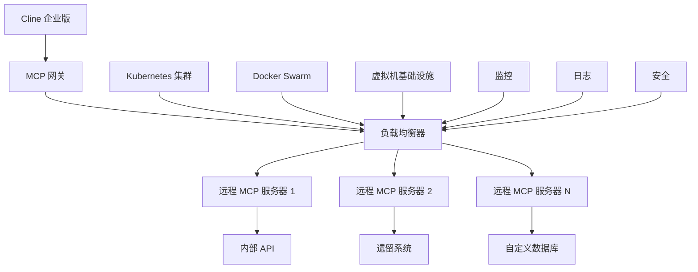

远程 MCP 服务器使你能够在保持企业安全性、治理和可扩展性要求的同时，部署自定义集成并连接到内部系统。与市场服务器不同，远程服务器为你提供对实施和部署的完全控制。

## 企业远程服务器优势

<CardGroup cols={2}>
  <Card title="自定义集成" icon="code">
    为专有系统、内部 API 和自定义工作流构建集成。
  </Card>
  
  <Card title="基础设施控制" icon="server">
    在你自己的基础设施上部署，完全控制网络和安全。
  </Card>
  
  <Card title="企业安全" icon="lock">
    实施特定于你需求的自定义身份验证、加密和审计日志。
  </Card>
  
  <Card title="可扩展架构" icon="chart-line">
    跨多个区域的自动扩展、负载均衡和高可用性。
  </Card>
</CardGroup>

## 架构概述



## 部署选项

### Kubernetes 部署

使用 Kubernetes 清单部署远程 MCP 服务器：

```yaml
# remote-mcp-deployment.yaml
apiVersion: apps/v1
kind: Deployment
metadata:
  name: custom-api-mcp-server
  namespace: cline-enterprise
  labels:
    app: custom-api-mcp
    version: v1.2.0
spec:
  replicas: 3
  selector:
    matchLabels:
      app: custom-api-mcp
  template:
    metadata:
      labels:
        app: custom-api-mcp
        version: v1.2.0
    spec:
      serviceAccountName: mcp-server-sa
      containers:
      - name: mcp-server
        image: company/custom-api-mcp:v1.2.0
        ports:
        - containerPort: 8080
          name: http
        - containerPort: 9090
          name: metrics
          
        env:
        - name: MCP_SERVER_PORT
          value: "8080"
        - name: METRICS_PORT
          value: "9090"
        - name: LOG_LEVEL
          value: "INFO"
        - name: DATABASE_URL
          valueFrom:
            secretKeyRef:
              name: mcp-secrets
              key: database-url
        - name: API_TOKEN
          valueFrom:
            secretKeyRef:
              name: mcp-secrets
              key: api-token
              
        resources:
          requests:
            memory: "256Mi"
            cpu: "100m"
          limits:
            memory: "512Mi"
            cpu: "500m"
            
        livenessProbe:
          httpGet:
            path: /health
            port: 8080
          initialDelaySeconds: 30
          periodSeconds: 10
          
        readinessProbe:
          httpGet:
            path: /ready
            port: 8080
          initialDelaySeconds: 5
          periodSeconds: 5
          
        securityContext:
          allowPrivilegeEscalation: false
          runAsNonRoot: true
          runAsUser: 1001
          capabilities:
            drop:
            - ALL

---
apiVersion: v1
kind: Service
metadata:
  name: custom-api-mcp-service
  namespace: cline-enterprise
spec:
  selector:
    app: custom-api-mcp
  ports:
  - name: http
    port: 80
    targetPort: 8080
  - name: metrics
    port: 9090
    targetPort: 9090
  type: ClusterIP

---
apiVersion: networking.k8s.io/v1
kind: Ingress
metadata:
  name: custom-api-mcp-ingress
  namespace: cline-enterprise
  annotations:
    nginx.ingress.kubernetes.io/ssl-redirect: "true"
    cert-manager.io/cluster-issuer: "letsencrypt-prod"
spec:
  tls:
  - hosts:
    - mcp-custom-api.company.com
    secretName: mcp-custom-api-tls
  rules:
  - host: mcp-custom-api.company.com
    http:
      paths:
      - path: /
        pathType: Prefix
        backend:
          service:
            name: custom-api-mcp-service
            port:
              number: 80
```

### Docker Compose 部署

适用于较小规模的部署或开发环境：

```yaml
# docker-compose.yml
version: '3.8'

services:
  custom-api-mcp:
    image: company/custom-api-mcp:v1.2.0
    ports:
      - "8080:8080"
      - "9090:9090"
    environment:
      - MCP_SERVER_PORT=8080
      - METRICS_PORT=9090
      - LOG_LEVEL=INFO
      - DATABASE_URL=${DATABASE_URL}
      - API_TOKEN=${API_TOKEN}
    volumes:
      - ./config:/app/config:ro
      - ./logs:/app/logs
    healthcheck:
      test: ["CMD", "curl", "-f", "http://localhost:8080/health"]
      interval: 30s
      timeout: 10s
      retries: 3
    restart: unless-stopped
    deploy:
      replicas: 3
      resources:
        limits:
          cpus: '0.5'
          memory: 512M
        reservations:
          cpus: '0.1'
          memory: 256M

  nginx-load-balancer:
    image: nginx:alpine
    ports:
      - "80:80"
      - "443:443"
    volumes:
      - ./nginx.conf:/etc/nginx/nginx.conf:ro
      - ./ssl:/etc/ssl/certs:ro
    depends_on:
      - custom-api-mcp
    restart: unless-stopped

  prometheus:
    image: prom/prometheus:latest
    ports:
      - "9091:9090"
    volumes:
      - ./prometheus.yml:/etc/prometheus/prometheus.yml:ro
    command:
      - '--config.file=/etc/prometheus/prometheus.yml'
      - '--web.external-url=http://localhost:9091'
    restart: unless-stopped
```

### 虚拟机部署

使用基础设施自动化工具部署：

<Tabs>
<Tab title="Terraform">
```hcl
# main.tf
resource "aws_instance" "mcp_server" {
  count                  = var.instance_count
  ami                    = var.ami_id
  instance_type         = var.instance_type
  key_name              = var.key_name
  vpc_security_group_ids = [aws_security_group.mcp_server.id]
  subnet_id             = var.subnet_ids[count.index % length(var.subnet_ids)]
  
  user_data = templatefile("${path.module}/user_data.sh", {
    mcp_image    = var.mcp_server_image
    database_url = var.database_url
    api_token    = var.api_token
  })
  
  tags = {
    Name = "mcp-server-${count.index + 1}"
    Environment = var.environment
    Project = "cline-enterprise"
  }
}

resource "aws_security_group" "mcp_server" {
  name_prefix = "mcp-server-"
  vpc_id      = var.vpc_id

  ingress {
    from_port   = 8080
    to_port     = 8080
    protocol    = "tcp"
    cidr_blocks = var.allowed_cidrs
  }
  
  ingress {
    from_port   = 22
    to_port     = 22
    protocol    = "tcp"
    cidr_blocks = var.admin_cidrs
  }

  egress {
    from_port   = 0
    to_port     = 0
    protocol    = "-1"
    cidr_blocks = ["0.0.0.0/0"]
  }
}

resource "aws_lb" "mcp_server" {
  name               = "mcp-server-alb"
  internal           = false
  load_balancer_type = "application" 
  security_groups    = [aws_security_group.mcp_alb.id]
  subnets           = var.subnet_ids

  enable_deletion_protection = var.environment == "production"
}
```
</Tab>

<Tab title="Ansible">
```yaml
# deploy-mcp-server.yml
---
- name: Deploy MCP Server
  hosts: mcp_servers
  become: yes
  vars:
    mcp_image: "company/custom-api-mcp:v1.2.0"
    mcp_port: 8080
    metrics_port: 9090
    
  tasks:
    - name: Install Docker
      yum:
        name: docker
        state: present
        
    - name: Start Docker service
      systemd:
        name: docker
        state: started
        enabled: yes
        
    - name: Create MCP user
      user:
        name: mcp
        shell: /bin/false
        home: /opt/mcp
        system: yes
        
    - name: Create MCP directories
      file:
        path: "{{ item }}"
        state: directory
        owner: mcp
        group: mcp
        mode: '0755'
      loop:
        - /opt/mcp
        - /opt/mcp/config
        - /opt/mcp/logs
        - /opt/mcp/data
        
    - name: Copy MCP configuration
      template:
        src: mcp-config.yml.j2
        dest: /opt/mcp/config/mcp-config.yml
        owner: mcp
        group: mcp
        mode: '0600'
      notify: restart mcp
      
    - name: Pull MCP Docker image
      docker_image:
        name: "{{ mcp_image }}"
        source: pull
        
    - name: Create MCP container
      docker_container:
        name: mcp-server
        image: "{{ mcp_image }}"
        state: started
        restart_policy: unless-stopped
        ports:
          - "{{ mcp_port }}:8080"
          - "{{ metrics_port }}:9090"
        volumes:
          - "/opt/mcp/config:/app/config:ro"
          - "/opt/mcp/logs:/app/logs"
          - "/opt/mcp/data:/app/data"
        env:
          MCP_CONFIG_PATH: "/app/config/mcp-config.yml"
          LOG_LEVEL: "{{ log_level | default('INFO') }}"
        healthcheck:
          test: ["CMD", "curl", "-f", "http://localhost:8080/health"]
          interval: 30s
          timeout: 10s
          retries: 3
          
  handlers:
    - name: restart mcp
      docker_container:
        name: mcp-server
        restart: yes
```
</Tab>
</Tabs>

## 服务器配置

### 基本配置

配置你的自定义 MCP 服务器：

```yaml
# mcp-server-config.yaml
server:
  name: "custom-api-mcp-server"
  version: "1.2.0"  
  description: "Custom API integration server"
  port: 8080
  
  # 身份验证配置
  auth:
    method: "jwt"
    jwt_secret: "${JWT_SECRET}"
    token_expiry: "24h"
    
    # 可选：mTLS 身份验证
    mtls:
      enabled: false
      cert_path: "/certs/server.crt"
      key_path: "/certs/server.key"
      ca_path: "/certs/ca.crt"
      
  # 速率限制
  rate_limiting:
    enabled: true
    requests_per_minute: 1000
    burst_size: 100
    
  # CORS 配置
  cors:
    enabled: true
    allowed_origins: ["https://*.company.com"]
    allowed_methods: ["GET", "POST", "PUT", "DELETE"]
    allowed_headers: ["Authorization", "Content-Type"]

# 工具配置
tools:
  - name: "query_database" 
    description: "Query company database"
    timeout: "30s"
    parameters:
      - name: "query"
        type: "string"
        required: true
        description: "SQL query to execute"
        validation: "^SELECT.*"  # Only allow SELECT queries
        
  - name: "create_ticket"
    description: "Create a support ticket"
    timeout: "10s"
    parameters:
      - name: "title"
        type: "string" 
        required: true
      - name: "description"
        type: "string"
        required: true
      - name: "priority"
        type: "string"
        enum: ["low", "medium", "high", "critical"]
        default: "medium"

# 资源配置
resources:
  - name: "user_profiles"
    description: "User profile data"
    type: "collection"
    endpoint: "/api/users"
    
  - name: "project_data"
    description: "Project information"
    type: "collection"
    endpoint: "/api/projects"

# 外部服务连接
services:
  database:
    type: "postgresql"
    host: "${DB_HOST}"
    port: 5432
    database: "${DB_NAME}"
    username: "${DB_USERNAME}"
    password: "${DB_PASSWORD}"
    ssl_mode: "require"
    max_connections: 10
    
  api:
    type: "rest"
    base_url: "https://api.internal.company.com"
    timeout: "30s"
    authentication:
      type: "bearer_token"
      token: "${API_TOKEN}"
      
# 监控和可观测性
monitoring:
  metrics:
    enabled: true
    port: 9090
    path: "/metrics"
    
  health_checks:
    enabled: true
    endpoint: "/health"
    checks:
      - name: "database"
        type: "database_connection"
      - name: "api"
        type: "http_request"
        url: "https://api.internal.company.com/health"
        
  logging:
    level: "INFO"
    format: "json"
    destinations: ["stdout", "file"]
    file_path: "/app/logs/mcp-server.log"
    max_file_size: "100MB"
    max_files: 10
    
# 安全设置
security:
  audit_logging: true
  request_validation: true  
  response_sanitization: true
  
  # 输入验证
  validation:
    max_request_size: "10MB"
    allowed_content_types: ["application/json"]
    sanitize_html: true
    
  # 网络安全
  network:
    bind_address: "0.0.0.0"
    trusted_proxies: ["10.0.0.0/8", "172.16.0.0/12", "192.168.0.0/16"]
```

### 高级配置

具有高可用性的企业级配置：

```yaml
# enterprise-mcp-config.yaml  
server:
  cluster:
    enabled: true
    node_id: "${NODE_ID}"
    discovery:
      method: "kubernetes"
      service_name: "mcp-server-cluster"
      
  high_availability:
    enabled: true
    leader_election: true
    health_check_interval: "10s"
    failover_timeout: "30s"
    
  scaling:
    auto_scaling: true
    min_replicas: 2
    max_replicas: 10
    target_cpu_utilization: 70
    target_memory_utilization: 80
    
  performance:
    connection_pooling: true
    max_connections: 1000
    keep_alive_timeout: "60s"
    request_timeout: "30s"
    
    caching:
      enabled: true
      type: "redis"
      redis_url: "${REDIS_URL}"
      ttl: "300s"
      
# 企业身份验证
authentication:
  providers:
    - name: "enterprise_sso"
      type: "oidc"
      issuer: "https://sso.company.com"
      client_id: "${OIDC_CLIENT_ID}"
      client_secret: "${OIDC_CLIENT_SECRET}"
      
    - name: "service_accounts"
      type: "jwt"
      signing_key: "${SERVICE_ACCOUNT_KEY}"
      
  authorization:
    rbac:
      enabled: true
      policy_file: "/app/config/rbac-policy.json"
      
# 企业监控
monitoring:
  observability:
    tracing:
      enabled: true
      exporter: "jaeger"
      jaeger_endpoint: "${JAEGER_ENDPOINT}"
      
    metrics:
      exporters: ["prometheus", "datadog"]
      custom_metrics: true
      
  alerting:
    enabled: true
    rules:
      - name: "high_error_rate"
        condition: "error_rate > 0.05"
        severity: "warning"
        notification: ["slack", "email"]
        
      - name: "service_down"
        condition: "health_check_failures > 3"
        severity: "critical"
        notification: ["pagerduty", "slack"]
        
# 企业合规
compliance:
  data_governance:
    classification: "internal"
    retention_policy: "365d"
    encryption:
      at_rest: true
      in_transit: true
      key_rotation: "90d"
      
  audit:
    enabled: true
    log_all_requests: true
    log_responses: false  # Don't log sensitive response data
    retention: "7y"
    destinations: ["elasticsearch", "s3"]
    
  privacy:
    pii_detection: true
    data_masking: true
    gdpr_compliance: true
```

## 自定义服务器开发

### 服务器实现

使用企业 SDK 创建自定义 MCP 服务器：

```typescript
// src/custom-mcp-server.ts
import { 
  MCPServer, 
  Tool, 
  Resource, 
  ServerConfig 
} from '@cline/mcp-enterprise-sdk';
import { DatabaseService } from './services/database';
import { APIService } from './services/api';
import { AuditLogger } from './utils/audit-logger';

class CustomAPIMCPServer extends MCPServer {
  private database: DatabaseService;
  private apiService: APIService;
  private auditLogger: AuditLogger;
  
  constructor(config: ServerConfig) {
    super({
      name: 'custom-api-mcp-server',
      version: '1.2.0',
      description: 'Custom API integration server for enterprise'
    });
    
    this.database = new DatabaseService(config.database);
    this.apiService = new APIService(config.api);
    this.auditLogger = new AuditLogger(config.audit);
    
    this.setupTools();
    this.setupResources();
  }
  
  private setupTools(): void {
    this.addTool(new DatabaseQueryTool(this.database, this.auditLogger));
    this.addTool(new CreateTicketTool(this.apiService, this.auditLogger));
    this.addTool(new UserLookupTool(this.database, this.auditLogger));
  }
  
  private setupResources(): void {
    this.addResource(new UserProfilesResource(this.database));
    this.addResource(new ProjectDataResource(this.apiService));
  }
  
  async start(): Promise<void> {
    await this.database.connect();
    await this.apiService.initialize();
    await super.start();
    
    this.auditLogger.info('Custom MCP Server started successfully');
  }
  
  async stop(): Promise<void> {
    await this.database.disconnect();
    await super.stop();
    
    this.auditLogger.info('Custom MCP Server stopped');
  }
}

// Tool implementations
class DatabaseQueryTool implements Tool {
  name = 'query_database';
  description = 'Execute SQL queries against company database';
  
  constructor(
    private database: DatabaseService,
    private auditLogger: AuditLogger
  ) {}
  
  async execute(params: any, context: any): Promise<any> {
    // Validate user permissions
    if (!context.user.hasPermission('database:query')) {
      throw new Error('Insufficient permissions for database queries');
    }
    
    // Validate SQL query
    const { query } = params;
    if (!this.isValidQuery(query)) {
      throw new Error('Invalid or unsafe SQL query');
    }
    
    // Execute query
    const startTime = Date.now();
    const result = await this.database.query(query);
    const duration = Date.now() - startTime;
    
    // Audit log
    await this.auditLogger.logToolExecution({
      tool: this.name,
      user: context.user.id,
      parameters: { query: this.sanitizeQuery(query) },
      result_count: Array.isArray(result) ? result.length : 1,
      duration_ms: duration,
      success: true
    });
    
    return {
      data: result,
      metadata: {
        row_count: Array.isArray(result) ? result.length : 1,
        execution_time_ms: duration
      }
    };
  }
  
  private isValidQuery(query: string): boolean {
    // Implement SQL validation logic
    const allowedOps = ['SELECT', 'SHOW', 'DESCRIBE', 'EXPLAIN'];
    const upperQuery = query.trim().toUpperCase();
    return allowedOps.some(op => upperQuery.startsWith(op));
  }
  
  private sanitizeQuery(query: string): string {
    // Remove potentially sensitive data from query for logging
    return query.replace(/password\s*=\s*'[^']*'/gi, "password='****'");
  }
}

class CreateTicketTool implements Tool {
  name = 'create_ticket';
  description = 'Create a support ticket in ticketing system';
  
  constructor(
    private apiService: APIService,
    private auditLogger: AuditLogger
  ) {}
  
  async execute(params: any, context: any): Promise<any> {
    const { title, description, priority = 'medium' } = params;
    
    // Create ticket via API
    const ticket = await this.apiService.createTicket({
      title,
      description,
      priority,
      reporter: context.user.email,
      source: 'cline-mcp'
    });
    
    // Audit log
    await this.auditLogger.logToolExecution({
      tool: this.name,
      user: context.user.id,
      parameters: { title, priority },
      result: { ticket_id: ticket.id },
      success: true
    });
    
    return {
      ticket_id: ticket.id,
      ticket_url: `https://support.company.com/tickets/${ticket.id}`,
      status: ticket.status
    };
  }
}

// Export server factory
export function createCustomMCPServer(config: ServerConfig): CustomAPIMCPServer {
  return new CustomAPIMCPServer(config);
}
```

### Dockerfile

创建容器化部署：

```dockerfile
# Dockerfile
FROM node:18-alpine AS builder

WORKDIR /app

# Copy package files
COPY package*.json ./
COPY tsconfig.json ./

# Install dependencies
RUN npm ci --only=production

# Copy source code
COPY src/ ./src/

# Build TypeScript
RUN npm run build

FROM node:18-alpine AS runtime

# Create non-root user
RUN addgroup -g 1001 mcp && \
    adduser -S -u 1001 -G mcp mcp

WORKDIR /app

# Copy built application
COPY --from=builder /app/dist ./dist
COPY --from=builder /app/node_modules ./node_modules
COPY --from=builder /app/package*.json ./

# Create required directories
RUN mkdir -p /app/logs /app/data && \
    chown -R mcp:mcp /app

# Switch to non-root user
USER mcp

# Health check
HEALTHCHECK --interval=30s --timeout=10s --start-period=5s --retries=3 \
  CMD curl -f http://localhost:8080/health || exit 1

# Expose ports
EXPOSE 8080 9090

# Start server
CMD ["node", "dist/index.js"]
```

## 监控与运维

### 健康检查

实施全面的健康检查：

```typescript
// src/health/health-checker.ts
export class HealthChecker {
  private checks: Map<string, HealthCheck> = new Map();
  
  addCheck(name: string, check: HealthCheck): void {
    this.checks.set(name, check);
  }
  
  async runAllChecks(): Promise<HealthReport> {
    const results = new Map<string, HealthCheckResult>();
    let overallStatus = 'healthy';
    
    for (const [name, check] of this.checks) {
      try {
        const result = await check.execute();
        results.set(name, result);
        
        if (result.status !== 'healthy') {
          overallStatus = result.status === 'critical' ? 'critical' : 'degraded';
        }
      } catch (error) {
        results.set(name, {
          status: 'critical',
          message: error.message,
          timestamp: new Date().toISOString()
        });
        overallStatus = 'critical';
      }
    }
    
    return {
      status: overallStatus,
      checks: Object.fromEntries(results),
      timestamp: new Date().toISOString()
    };
  }
}

// Database health check
export class DatabaseHealthCheck implements HealthCheck {
  constructor(private database: DatabaseService) {}
  
  async execute(): Promise<HealthCheckResult> {
    try {
      await this.database.query('SELECT 1');
      return {
        status: 'healthy',
        message: 'Database connection successful',
        timestamp: new Date().toISOString()
      };
    } catch (error) {
      return {
        status: 'critical',
        message: `Database connection failed: ${error.message}`,
        timestamp: new Date().toISOString()
      };
    }
  }
}
```

### 指标收集

导出 Prometheus 指标：

```typescript
// src/metrics/metrics-collector.ts
import { register, Counter, Histogram, Gauge } from 'prom-client';

export class MetricsCollector {
  private requestCounter = new Counter({
    name: 'mcp_requests_total',
    help: 'Total number of MCP requests',
    labelNames: ['method', 'tool', 'status']
  });
  
  private requestDuration = new Histogram({
    name: 'mcp_request_duration_seconds',
    help: 'MCP request duration in seconds',
    labelNames: ['method', 'tool'],
    buckets: [0.1, 0.3, 0.5, 0.7, 1, 3, 5, 7, 10]
  });
  
  private activeConnections = new Gauge({
    name: 'mcp_active_connections',
    help: 'Number of active MCP connections'
  });
  
  recordRequest(method: string, tool: string, status: string, duration: number): void {
    this.requestCounter.inc({ method, tool, status });
    this.requestDuration.observe({ method, tool }, duration);
  }
  
  setActiveConnections(count: number): void {
    this.activeConnections.set(count);
  }
  
  getMetrics(): string {
    return register.metrics();
  }
}
```

## 最佳实践

### 安全性
1. **身份验证**：实施强大的身份验证（JWT、mTLS、OIDC）
2. **授权**：使用 RBAC 实现细粒度访问控制
3. **输入验证**：验证并清理所有输入
4. **输出清理**：清理响应以防止数据泄露
5. **网络安全**：使用 TLS、防火墙和网络策略

### 性能
1. **连接池**：重用数据库和 API 连接
2. **缓存**：实施智能缓存策略
3. **异步操作**：使用非阻塞 I/O 提高并发性
4. **资源限制**：设置适当的 CPU 和内存限制
5. **负载测试**：在 realistic 负载条件下测试

### 可靠性
1. **健康检查**：实施全面的健康监控
2. **断路器**：当依赖项不可用时快速失败
3. **重试逻辑**：对瞬时故障实施指数退避
4. **优雅关闭**：正确处理关闭信号
5. **数据一致性**：确保跨操作的数据完整性

### 可观测性
1. **结构化日志**：使用 JSON 日志以便更好地解析
2. **分布式追踪**：实施请求流追踪
3. **指标**：向监控系统导出全面的指标
4. **警报**：为关键问题设置主动警报
5. **仪表板**：创建运维仪表板用于监控

## 生产检查清单

在将远程 MCP 服务器部署到生产环境之前：

- [ ] 安全审查和渗透测试已完成
- [ ] 身份验证和授权正确配置
- [ ] 输入验证和输出清理已实施
- [ ] 全面的监控和警报已设置
- [ ] 在 realistic 条件下完成负载测试
- [ ] 灾难恢复和备份程序已记录
- [ ] 健康检查和就绪探针已配置
- [ ] 资源限制和扩展策略已定义
- [ ] 审计日志和合规要求已满足
- [ ] 文档已更新和团队培训已完成

远程 MCP 服务器提供与任何系统集成的灵活性，同时保持企业级的安全性和可靠性。从最适合你基础设施的部署选项开始，并根据需要进行扩展。
